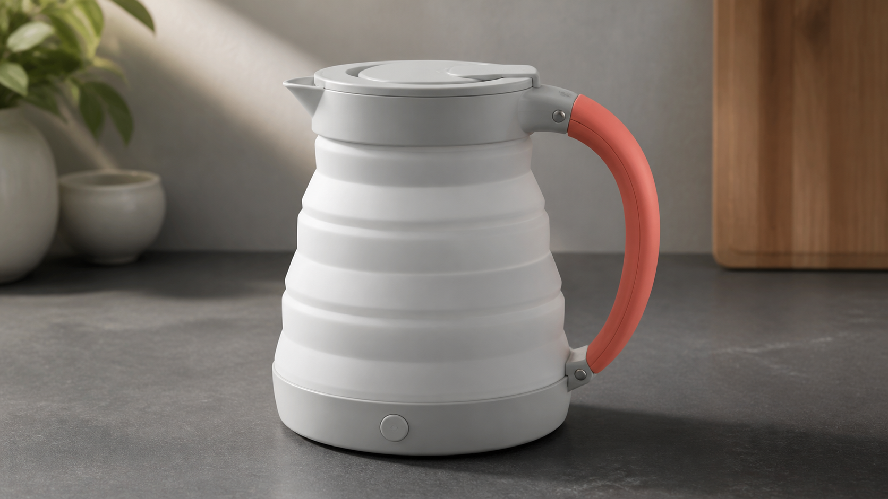
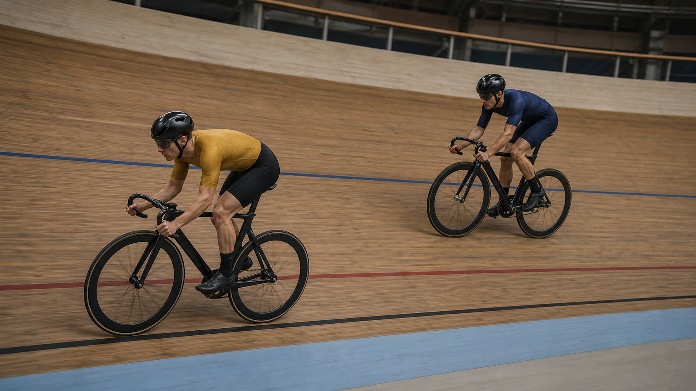
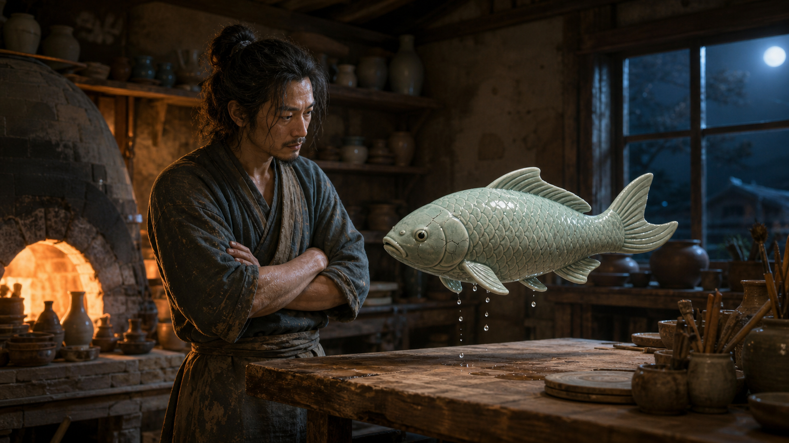
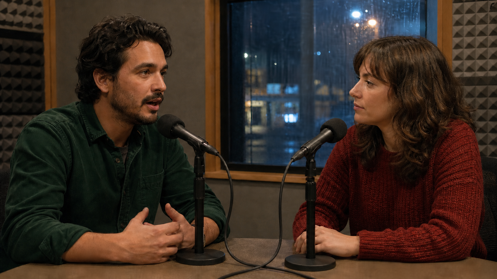
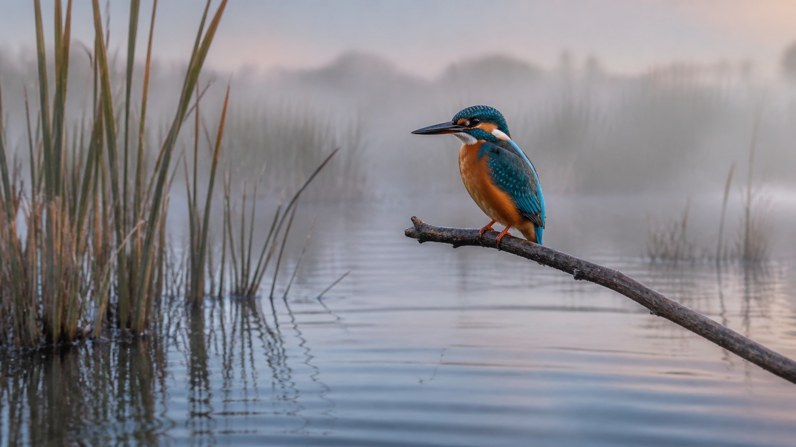
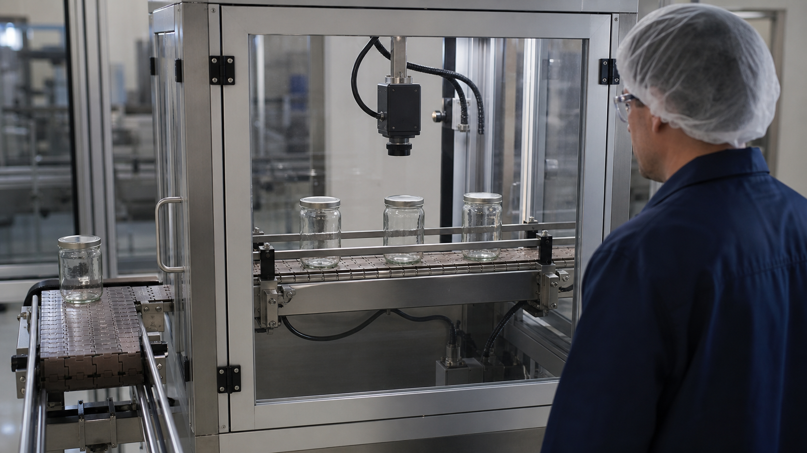

<p align="center"><a href="https://bestimage.ai/"></a></p>

# Wan 3.0 视频提示词精选库

**由 [bestimage.ai](https://bestimage.ai/) 团队改编并维护，收录 14 类、148 条视频创作简报。** 先设计清晰的事件，再分配输入素材的职责、安排镜头和声音，并在投入制作前检查连续性。

[英文首页](README.md) · 简体中文 · [繁体中文](README.zh-TW.md) · [全部 15 种语言](locales/README.md) · [场景总索引](prompts/README.md)


*这是一张通过内置图像生成工具创作的静态概念图，并非 Wan 3.0 的视频输出。详见[图片提示词与来源说明](assets/README.md)。*

## 从可以检查的镜头开始

1. 从[完整场景索引](prompts/README.md)选择一条创作简报。
2. 替换可调细节，并准备所列输入素材。参考素材说明的是用途，并不代表仓库提供了这些文件。
3. 选择对应入口，在界面或请求字段中设置时长、画幅、分辨率和声音；只在提示词里写参数不会完成 API 配置。
4. 先做小规模试验，再根据简报的检查目标核对动作、几何结构、身份、时序和声音。

**14 个分类、148 个视频创作简报**。前 6 类使用中文创作简报，后 8 类使用英文简报。15 种语言提供本地化入口指南和同一条完整对照提示词，**并非把 148 条案例全部翻译成 15 种语言**。对照提示词及其译文不计入新增案例数量。

## 八层提示词结构

```text
[输出] 时长 + 画幅 + 视觉媒介
[主体] 固定身份特征 + 服装或材质 + 不可改变的细节
[环境] 时间 + 地点 + 天气 + 空间层次
[动作] 起因 → 连续动作 → 可见结果
[镜头] 景别 + 机位 + 单一运动路径 + 结束构图
[视觉] 光线 + 色彩 + 质感 + 运动模糊
[声音] 环境音 + 动作音 + 音乐 + 对白语言（平台支持时）
[约束] 必须保持的内容 + 需要避免的问题
```

## 完整对照提示词

**模式：**文生视频 · **设置：**10 秒、16:9、开启声音 · **输入素材：**无

```text
制作一个 10 秒、16:9 的纪录片镜头，地点是安静的社区工具借用室。一位留短卷发的成年志愿者穿着芥末黄色围裙和卷起袖子的海军蓝衬衫，在小型红色台扇始终拔掉插头的状态下进行维修。0–3 秒，志愿者把拆下的防护网罩放在静止的台扇旁。3–7 秒，用软布擦去一片扇叶上的灰尘，同时摄影机在桌面高度缓慢向右平移。7–10 秒，放下软布，将网罩对准外壳，不插电，也不启动台扇。窗外光线呈现出磨损金属和棉布的质感。声音：布料擦拭声、网罩一次轻轻的咔嗒声、安静的室内环境音；无对白、无音乐。保持同一个人物、同一台风扇、三片扇叶、红色外壳，以及始终未插电的电源线。不出现转动的扇叶、额外工具、可读标签、字幕或剪切。
```

**可调变量：**围裙颜色、台扇颜色、室内光线。**检查目标：**台扇始终未插电且保持静止；扇叶数量和手部接触关系保持一致。这是创意场景，不是电器维修操作指南。

## 按输入素材选择入口

| 入口 | 需要准备 | 创作与检查重点 |
|---|---|---|
| 文生视频 | 完整场景描述 | 一个事件的起因、中间动作和可见结果 |
| 图生视频 | bestimage.ai 已公开文档所述入口要求的首图**和尾图** | 说明物理过渡，固定几何结构和构图 |
| 参考生视频 | 可选的人物身份、物体、空间、动作或声音参考 | 每份素材只承担一种职责，排除参考中不需要的细节 |
| 视频编辑 | 源视频和一项范围明确的修改 | 保留原表演、时长、摄影机运动及所有未修改区域 |

这些是 bestimage.ai 文档中的入口，并不意味着所有 Wan 产品提供相同的控制项。阿里巴巴的 [Wan 3.0 官方发布资料](https://modelstudio.alibabacloud.com/intl/blog/wan3-ai-video-generation-model/)介绍了更长视频、多模态输入和音画生成。请阅读[能力与边界](guides/model-capabilities.md)，区分模型发布信息、平台字段和未经实测的创作指令。

## bestimage.ai 的 Wan 3.0 API

通过模型页查看当前体验界面和公开请求示例。

| 模型与用途 | 英文入口 |
|---|---|
| Wan 3.0 文生视频：把文字简报变成场景 | [模型与 API](https://bestimage.ai/models/alibaba/wan-3-0-text-to-video/) |
| Wan 3.0 图生视频：在设计好的画面之间生成过渡 | [模型与 API](https://bestimage.ai/models/alibaba/wan-3-0-image-to-video/) |
| Wan 3.0 参考生视频：通过参考控制身份与多模态表现 | [模型与 API](https://bestimage.ai/models/alibaba/wan-3-0-reference-to-video/) |
| Wan 3.0 视频编辑：修改现有片段 | [模型与 API](https://bestimage.ai/models/alibaba/wan-3-0-video-edit/) |

[API 工作流与成本控制指南](guides/bestimage-wan-3-api.md)包含请求体、轮询、输入检查和试验规划。**bestimage.ai 的 API 主机为 `https://api.flaq.ai`。** 请使用在 bestimage.ai 账户中获取的 API 密钥。

消耗额度前，请核对所选模型页与账号信息。

## 使用 GPT Image 2 API 准备参考画面

[GPT Image 2](https://bestimage.ai/models/openai/gpt-image-2/)用于生成静态图片；[GPT Image 2 Edit](https://bestimage.ai/models/openai/gpt-image-2-edit/)用于编辑图片并结合视觉参考。可以先准备角色设定图、产品参考，或审核通过的首尾构图，再进入 Wan 视频任务。

它们是**独立的图像模型**，不是 Wan 视频接口。导出并检查静态图片后，再把适合的图片提交给对应的 Wan 入口。本仓库未自动实现这一步衔接，也不声称概念插图来自这些 API。详见[参考画面工作流](guides/bestimage-wan-3-api.md#gpt-image-2-reference-frame-workflow)。

## 浏览全部 148 条创作简报

| 分类 | 数量 | 创作重点 |
|---|---:|---|
| [电影叙事](prompts/cinematic-storytelling.md) | 8 | 档案发现、安静的悬念、空间过渡 |
| [广告与产品](prompts/ads-and-products.md) | 8 | 产品结构、材质、倾倒动作、可重复的主体展示镜头 |
| [用户创作、美食与旅行](prompts/ugc-food-travel.md) | 8 | 主持人演示、手艺探访、食物与地方特色 |
| [动作与体育](prompts/action-sports.md) | 8 | 接触、动量、清晰路线、受控运动 |
| [动画与幻想](prompts/anime-fantasy.md) | 8 | 陶瓷、纸张、纺织品与微缩世界 |
| [音乐、喜剧与社交](prompts/music-comedy-social.md) | 8 | 短表演、喜剧节奏与循环 |
| [专业商业与公共服务](prompts/professional-business.md) | 13 | 服务说明、无障碍沟通、运营流程 |
| [教育与科学](prompts/education-science.md) | 13 | 演示模型、观察、因果关系 |
| [建筑、酒店与出行](prompts/architecture-mobility.md) | 13 | 空间连续性、路线、尺度与室内漫游 |
| [制作控制与编辑](prompts/production-control.md) | 13 | 参考职责、局部编辑、连续性与交付检查 |
| [电商、美妆与零售](prompts/commerce-beauty-retail.md) | 12 | 补充装、穿着贴合、包装、无障碍操作与商品目录 |
| [人物、对白与本地化](prompts/people-dialogue-localization.md) | 12 | 说话轮次、停顿、语言与听者反应 |
| [自然、动物与季节](prompts/nature-animals-seasons.md) | 12 | 非侵入式观察、水、天气与季节变化 |
| [工业与制造](prompts/industrial-manufacturing.md) | 12 | 检测、物料流动、有防护的设备与流程可视化 |

## 精选概念画面

每张静态图对应所链接分类中的第一条简报。单张图片无法证明时间连续性、口型同步、模型准确性或画面中流程的安全性。

| 产品表现 | 体育连续性 |
|---|---|
| [](prompts/ads-and-products.md) | [](prompts/action-sports.md) |

| 陶瓷幻想 | 零售补充装 |
|---|---|
| [](prompts/anime-fantasy.md) | [](prompts/commerce-beauty-retail.md) |

| 对白 | 自然 | 工业检测 |
|---|---|---|
| [](prompts/people-dialogue-localization.md) | [](prompts/nature-animals-seasons.md) | [](prompts/industrial-manufacturing.md) |

## 指南与贡献

[提示词指南](guides/prompting-guide.md)、[能力指南](guides/model-capabilities.md)和[故障排查指南](guides/troubleshooting.md)使用简体中文维护；API 指南使用英文。多语言入口明确说明这一覆盖范围，不表示所有指南均已翻译。

分享提示词或媒体前，请阅读[中文投稿说明](CONTRIBUTING.zh-CN.md)或[英文贡献指南](CONTRIBUTING.md)。请注明准确设置、输入职责、使用权、观察结果以及真实的已测或未测状态。不要分享凭证、私人文件或会过期的签名媒体链接。可按[投稿表单](.github/ISSUE_TEMPLATE/prompt.yml)准备所需信息。

## 关于 bestimage.ai

本提示词库由 [bestimage.ai](https://bestimage.ai/) 团队整理与维护，将实用创作流程与图像、视频模型 API 连接起来。

## 加入 bestimage.ai 联盟推广计划

制作教程、分享提示词或发布 API 集成案例？加入 [bestimage.ai 联盟推广计划](https://bestimage.ai/affiliate-program/)，向你的受众推荐 bestimage.ai，并获得推荐佣金。

- 受推荐用户的首笔有效付费订单，佣金为 **20%**。
- 该用户**注册后 60 天内**的后续有效付费订单，佣金为 **10%**。

订单资格与结算以[现行联盟协议](https://bestimage.ai/affiliate-agreement/)为准。

## 许可证

[MIT](LICENSE).
